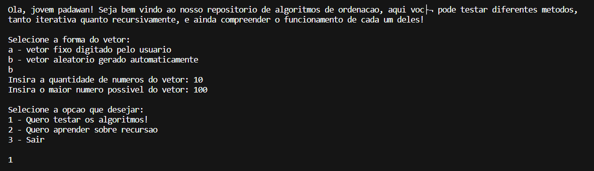
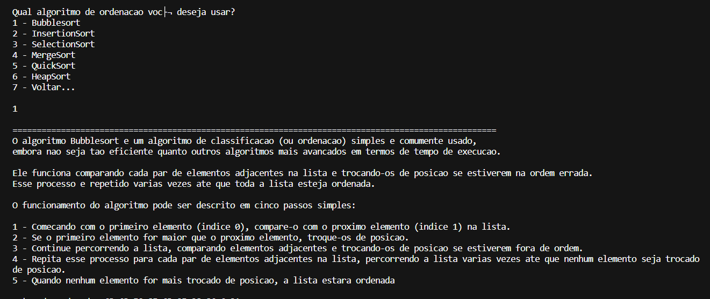
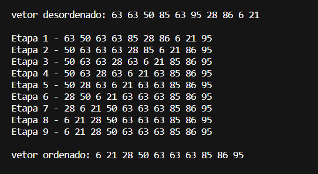

# Repositório de algoritmo de ordenação
## Conceito do projeto
Este projeto foi realizado com a finalidade de auxiliar os calouros da UFSCar-So e novos estudantes de programação sobre complexidade de algoritmos, ao reunir diversos dos algoritmos de ordenação mais básicos e conhecidos em um repositório que busca os ensinar de forma sucinta e prática seu funcionamento.
## Pré-Requisitos e recursos utilizados
O grupo utilizou linguagem C para desenvolver a implementação completa do projeto, utilizando apenas as bibiliotecas:
1. <stdio.h>
2. <stdlib.h>
3. <time.h>
Foram usados como base os algoritmos ensinados em aula da matéria Estrutura de Dados, lecionada pelo professor Mario Lizier, na Universidade Federal de São Carlos, campus Sorocaba.
## Passo a passo
Para o desenvolvimento do projeto foram estudados o funcionamento dos seguintes algoritmos de oredenação:
* Bubblesort
* InsertionSort
* SelectionSort
* MergeSort
* QuickSort
* HeapSort
## Execução
Para executar o projeto em seu terminal, vá até a pasta destino dos arquivos baixados e execute:
```
gcc main.c -o main
```
```
./main
```
## Autores
* Daniella Yuka Hirosue
* Pedro Henrique Alves de Araujo Silva

## Imagens/screenshot




